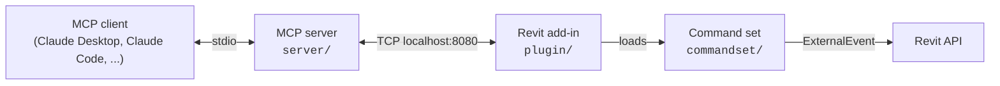

[](https://github.com/Kurill/revit-mcp-server)

# revit-mcp-server

**Connect AI assistants to Autodesk Revit through the Model Context Protocol.**

Claude Desktop, Claude Code and other MCP clients can read, create, modify and delete elements in the open Revit model: 147 tools covering project info, model health, clash detection, element creation and editing, views and sheets, schedules, site and shared coordinates, MEP, and PDF/DWG/IFC/Excel export.

> [!NOTE]
> This is a fork of [LuDattilo/revit-mcp-server](https://github.com/LuDattilo/revit-mcp-server). It adds open upstream PRs (Revit 2027 release asset, site/MEP/IFC tools, Node test suite, installer fixes) and makes the model-changing tools safe to hand to an AI agent. See [Safety](#safety).

## Architecture



| Component | Language | Role |
|-----------|----------|------|
| MCP server (`server/`) | TypeScript | Turns tool calls into JSON-RPC requests to the add-in |
| Revit add-in (`plugin/`) | C# | Starts with Revit and listens on `127.0.0.1`, port 8080 (8081–8089 if taken) until Revit closes. No ribbon buttons |
| Command set (`commandset/`) | C# | One command per tool, run on Revit's API thread |

## Safety

The AI works on the live model. These rules hold for every tool:

- **Dry run first.** Tools that change many elements at once (`import_from_excel`, `bulk_modify_parameter_values`, `clear_parameter_values`, `delete_element`, `wipe_empty_tags`, `purge_unused`, `manage_unplaced_views`) default to `dryRun=true` and return what would change: element, parameter, old value → new value. Nothing is written until the agent calls again with `dryRun=false`. The site/MEP tools accept `dryRun` too, but default to running.
- **Revit asks you.** Deletes, bulk parameter writes, Excel import, workset/phase/type changes and purges show a Revit dialog with the number of affected elements; the default button is No. The command waits up to 120 s for your answer.
- **Generated code runs without asking.** `send_code_to_revit` runs C# inside Revit with full access to the model and your files, so any program that can reach the add-in's port, and any MCP client, can run code in Revit. To review each run in a dialog first, set the user environment variable `REVIT_MCP_CONFIRM_CODE=1` (`setx REVIT_MCP_CONFIRM_CODE 1`); it is read on every run, so no restart is needed, and it survives reinstalls and updates.
- **A result is the real result.** Each call waits for its own run and reports its own outcome. If Revit rolls a transaction back (failure handling, or you cancel an error dialog), the tool reports an error instead of success. While a timed-out call is still pending in Revit (for example behind an open dialog), the same tool refuses new calls.
- **Units are explicit.** Excel import and bulk edits write values in the project's display units, the same form `export_to_excel` produces. `set_element_parameters` takes plain numbers in Revit internal units (feet, radians), as `get_element_parameters` returns them, or a string with a unit such as `"3000 mm"`. `export_room_data` returns m², m³ and m.
- **Exports cannot overwrite your models.** Export paths must be absolute and end in the format's extension (`.xlsx`, `.csv`/`.txt`/`.tsv`, `.ifc`, …).
- **Local only.** The add-in listens on `127.0.0.1` only and drops a connection on its first line that is not a JSON-RPC request, so a web page cannot drive it through a browser.

Still work on a **detached copy** of a project model until you trust a workflow, and check the result in Revit after bulk changes.

## Requirements

| | |
|---|---|
| Autodesk Revit | 2023, 2024, 2025, 2026 or 2027 |
| OS | Windows 10/11 |
| Node.js | 18+ (the installer offers to install it, or uses a bundled portable copy) |

## Install

### Option A: installer (recommended)

In PowerShell:

```powershell
powershell -ExecutionPolicy Bypass -Command "irm https://raw.githubusercontent.com/Kurill/revit-mcp-server/main/scripts/install.ps1 | iex"
```

It detects installed Revit versions, downloads the matching ZIP from the latest [release](https://github.com/Kurill/revit-mcp-server/releases), unblocks the DLLs, checks Node.js and adds a `revit-mcp` entry to Claude Desktop's config (other MCP servers in that file are kept, and the file is backed up first).

```powershell
.\install.ps1 -RevitVersion 2025   # one version only
.\install.ps1 -Tag v2.2.2-safety.1 # a specific release
.\install.ps1 -Uninstall
```

### Option B: from a release ZIP

1. Download `mcp-servers-for-revit-<version>-Revit<year>.zip` for your Revit version from [Releases](https://github.com/Kurill/revit-mcp-server/releases). Not the source code: it has no compiled DLLs.
2. Unzip it anywhere and run `INSTALLA.bat` from the unzipped folder. `DISINSTALLA.bat` removes it again.

The installer needs internet access in both cases (it checks `api.github.com` first).

Installed layout:

```
%APPDATA%\Autodesk\Revit\Addins\2025\
├── mcp-servers-for-revit.addin
└── revit_mcp_plugin\
    ├── RevitMCPPlugin.dll, RevitMCPSDK.dll, Newtonsoft.Json.dll
    └── Commands\
        ├── commandRegistry.json             <- commands the add-in loads
        └── RevitMCPCommandSet\
            ├── 2025\RevitMCPCommandSet.dll
            └── server\build\index.js        <- the MCP server
```

## Updates

An installed release updates itself. When Revit closes, the add-in starts `auto-update.ps1` hidden. The script waits until no Revit is running, then checks the latest [release](https://github.com/Kurill/revit-mcp-server/releases). If its tag differs from `revit_mcp_plugin\version.txt`, it downloads the ZIP for that Revit year, verifies it against the release's `.sha256` file and copies it over the installation. The next Revit start runs the new version. Progress goes to `revit_mcp_plugin\logs\update-<date>.log`.

- Publishing a release is all it takes to update every machine that installed from a release.
- A source build has no `version.txt` and is never updated.
- Set the user environment variable `REVIT_MCP_AUTO_UPDATE=0` to turn updates off.
- Anyone who can publish a release in this repository can ship code to those machines, so keep 2FA on the GitHub account.

## Connect an MCP client

**Claude Desktop** is configured by the installer. To repair the entry later:

```powershell
powershell -ExecutionPolicy Bypass -File scripts\fix-mcp.ps1
```

**Claude Code**:

```bash
claude mcp add revit-mcp -- node "%APPDATA%\Autodesk\Revit\Addins\2025\revit_mcp_plugin\Commands\RevitMCPCommandSet\server\build\index.js"
```

**Other clients:** command `node`, argument = the `index.js` path above, transport stdio.

Use the server from the plugin folder. The `mcp-server-for-revit` package on npm is published by the upstream project and does not have this fork's changes.

## Use

Open the model in Revit and ask your MCP client. The add-in has no buttons: its server starts once Revit has loaded and stays up until Revit closes. Its log is in `revit_mcp_plugin\logs\` next to the `.addin` file.

The full tool reference with parameters and examples is in [COMMANDS.md](COMMANDS.md).

## Known limitations

| | |
|---|---|
| Active document only | Tools act on the active document; background documents are not reachable |
| Localized names | Parameter names follow the Revit UI language. Categories can be given as `OST_*` names; some tools still match localized category names |
| No socket authentication | Any program running under your Windows user can connect to the add-in's port |
| Timeouts do not cancel | A call that times out keeps running in Revit; the tool reports it and refuses new calls until it finishes |
| Undo | Each tool call is its own Revit transaction, so undo goes one call at a time |
| Clash detection | Exact solid intersection only, stops after 20 s on large sets (`stoppedEarly` in the response); `tolerance` is ignored |

## Troubleshooting

| Problem | Fix |
|---------|-----|
| Nothing answers after install | Source code was copied instead of a release ZIP, or files are missing. Uninstall and install from a release |
| Add-in missing from Add-Ins | `mcp-servers-for-revit.addin` must sit directly in `Addins\<year>\`, and the ZIP year must match Revit |
| Client says "connection refused" | Revit must be open and fully loaded; the add-in log says whether the server started. Another program may hold 8080–8089: `netstat -ano \| findstr :808` |
| A tool is "not found" | The installed `commandRegistry.json` is older than the server. Reinstall the plugin |
| "previous call timed out and is still pending" | A Revit dialog is waiting for you, or Revit is still working. Answer it, check the model, then retry |
| Tool list in Claude Desktop is stale | Restart Claude Desktop |

More in [INSTALLATION.md](INSTALLATION.md); `scripts\diagnose.ps1` checks an installation.

## Development

```bash
cd server && npm ci && npm run build && npm test
```

`npm run build` regenerates `tool-schemas.txt`; commit it with any tool change.

Open `mcp-servers-for-revit.sln` in Visual Studio 2022 or use `dotnet build`. Configurations `Debug|Release R23` … `R27`:

| Configuration | Revit | Target |
|---------------|-------|--------|
| R23, R24 | 2023, 2024 | .NET Framework 4.8 (needs MSBuild) |
| R25, R26 | 2025, 2026 | .NET 8 |
| R27 | 2027 | .NET 10 |

A build lays out the complete add-in under `plugin/bin/AddIn <year> <config>/`; Debug builds also copy it into your Revit Addins folder.

New commands derive from `GuardedCommandBase` (`commandset/Commands/Base/`) and implement `ExecuteCore`; their handler implements `ICompletionSignal`. Wrap transaction commits in `TransactionGuard.EnsureCommitted`, ask with `ConfirmationHelper.Confirm` before destructive writes, and default `dryRun` to `true`.

CI on every PR builds the R27 solution and runs the server tests on Windows and Ubuntu. The integration tests in `tests/commandset` need a licensed Revit 2027 on a self-hosted runner (`dotnet test -c Debug.R27 -r win-x64 tests/commandset`).

### Release

Pushing a `v*` tag builds all five Revit versions and publishes a GitHub release with one ZIP per version:

```powershell
./scripts/release.ps1 -Version X.Y.Z
git push origin main --tags
```

## Acknowledgements

| | |
|---|---|
| Roman Zarkhin | First MCP server for Revit — [romanzarkhin/revit-mcp](https://github.com/romanzarkhin/revit-mcp) |
| [mcp-servers-for-revit](https://github.com/mcp-servers-for-revit) community | Expanded it to 80+ tools across three repos |
| [sparx-fire](https://sparx-fire.com) (Bobby Galli) | Merged them into one solution |
| [LuDattilo](https://github.com/LuDattilo/revit-mcp-server) | Language-independent operation, PowerShell installer — the base of this fork |
| jhsmith409, xedoevgeniy-code | Upstream PRs merged here |

## License

MIT — see [LICENSE](LICENSE).

The software is provided as is. It executes commands on live Revit models; the authors are not liable for data loss or unintended changes. Autodesk and Revit are registered trademarks of Autodesk, Inc.; this project is not affiliated with Autodesk.
